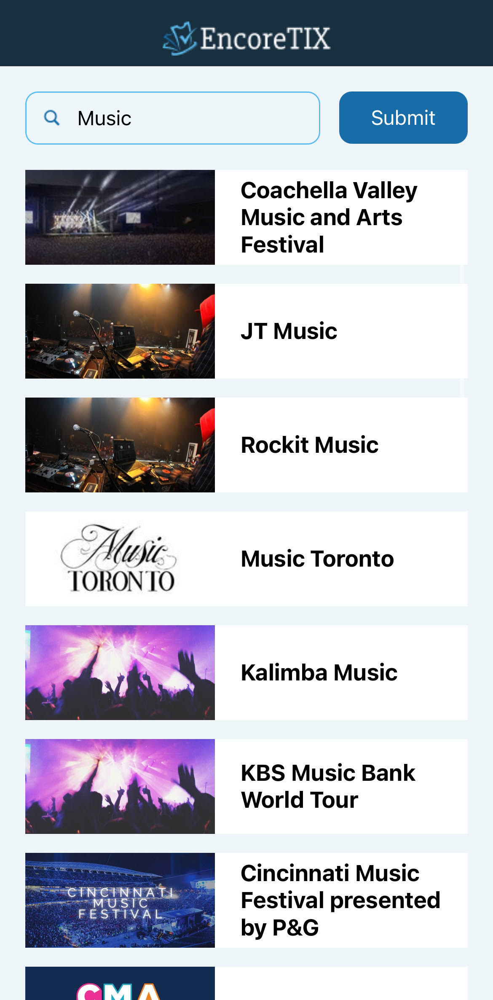
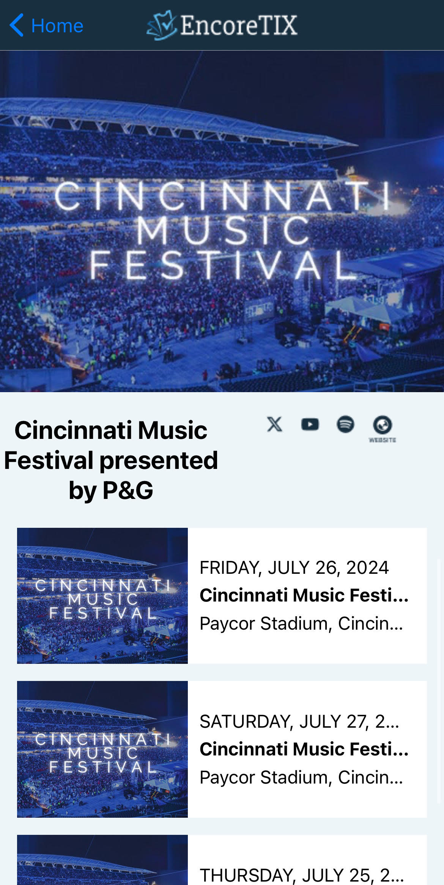

# EncoreTix

Date: 2/9/2024

Author: Ryan Freas

Frontend: React native with Expo 

Backend: Express.js

<hr/>

EncoreTix is a mobile application that lets you search for different attractions, allowing the user to view each attraction and its respective upcoming events, along with external links providing more information about the events.

| METHOD:    URL:                                        // DESCRIPTION                                    |
|--------------------------------------------------------------------------------------------------------------------------|
| GET:  https://hosted-tix.onrender.com/api/attractions/one/:id      // Get attraction by ID                   |
| GET:  https://hosted-tix.onrender.com/api/attractions/:searchTerm  // Get attractions, filter by search term |

<hr/>

## Requirements

You must have [Node.js LTS release](https://nodejs.org/en/) installed on your machine.


Additionally, [download Git](https://git-scm.com/) for source control.


Install [Expo Go](https://expo.dev/client) on your phone from the app store and create an account.

## Getting started

1. Clone this repository on your local machine: 

```
 git clone https://github.com/ryan2625/EncoreTix.git
```

2. Go to the project directory

```
cd EncoreTix/client
```

3. Install dependencies

```
npm install
```

4. Run app

```
npm start
```

5. Scan the QR code with your phone camera or a QR scanner to view the app.
   
   -The app will take a few seconds to build, but the QR code will display in the terminal when ready.


The backend is hosted externally on Cyclic.sh, so you don't need to set the server up locally. UPDATE 2024: Now hosted on Render, as cyclic has shut down. Please allow a few minutes for the server to come online when running the app.

The repo for the hosted backend (as cyclic.sh only allows you to host 1 app per github profile and I met this limit already. The server code in that repo is identical to the server code in this repo): https://github.com/Westbrook1000/hosted-tix

## Images

Splash Screen: 


Home Page:



Attraction Details:


